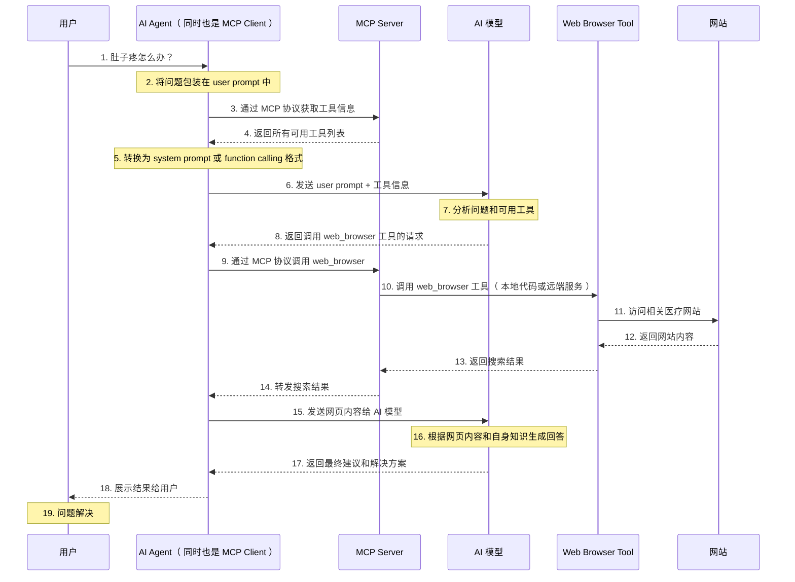

# 1. Agent

## 1.1 发展过程

- agent 相比于单纯 LLM 模型，最主要的差别就是能自主去完成任务，最初尝试的是开源项目 auto GPT，是本地运行的 python 程序
- 比如想让 auto GPT 完成管理电脑文件这个任务
  - 需要用户前置提供一些工具函数，比如 read_files(path) 读取文件
  - 然后将函数名以及对应功能描述注册到 auto GPT，会根据这些信息生成一个 system prompt，告诉 AI 模型用户给了哪些工具，对应作用是什么，以及如果想要使用他们应该返回什么样的格式
  - 将 system prompt 连同 user prompt 一起发给模型
  - 举例

    ```
    # user promot
    我想查找 /user/install 下的全部文件，可以使用 read_files 工具

    # 模型返回
    ···
    <tool_call>
      <tool>read_files</tool>
      <path>/user/bin</path>
    </tool_call>
    ```

- 类似 auto GPT 这种负责在 模型 和 用户 之间重复传话的程序就叫做 AI Agent，而这些提供给 AI Agent 的工具函数/接口叫做 Tool
- 但这种架构存在问题
  - 虽然在 system promot 指定了 模型 应该用什么格式返回，但是 LLM 模型只是一个概率模型，还是可能存在返回格式不对的场景
  - 最开始很多模型会在 AI 返回格式不对时，进行重试
  - 后续大模型厂商推出 Function Calling 功能

## 1.2 基础定义

- agent 是一个能自主执行任务，做出决策并与环境交互 的助手，根据 OpenAI 的技术定义，一个完整的 AI Agent 系统需要具备 4 个关键模块
  - 感知：通过输入设备或数据接口获取环境信息，包括文本，图像，音频等多模态数据的处理能力
  - 推理与规划：基于获取的信息进行逻辑推理，分解复杂任务为可执行的子任务序列，制定最优执行路径
  - 工具调用：通过 API 接口或外部工具与环境进行交互，扩展 Agent 的能力边界
  - 记忆：利用向量数据库等技术存储上下文信息，支持连续对话和长期任务衔接
- 常见基础概念包括：Tool，Function Calling，MCP，Skill

# 2. Tool

- Tool 是 Agent 可以调用的具体功能单元，用于执行特定任务，是 Agent 与外部交互的关键组件
- 通常每一个 Tool 专注解决某一个特定的问题，比如一个函数，功能可以是 查询天气，发送邮件，创建文件 等

# 3. Function Calling

## 3.1 基础介绍

- 之前 auto GPT 是通过自然语言，在 system prompt 中告诉模型 tool 的定义
- Function Calling 的核心思想是 规范化工具的描述 和 使用工具时模型应该返回的格式，比如每个 tool 都用 json 定义，这些 JSON 也从 system prompt 中剥离出来，单独放在一个字段里
  ```json
  {
    "name": "工具名称",
    "description": "功能描述",
    "parameters": {
      "参数 1": {
        "type": "参数类型",
        "description": "参数描述"
      },
      "参数 2": {
        "type": "参数类型",
        "description": "参数描述"
      }
    }
  }
  ```
- 所有的工具描述都是相同的格式，且都放在相同的地方，模型使用工具时的回复也依照相同的格式，这种情况即使模型生成错误的回复，由于回复格式固定，模型的服务器端也可以检测到，并进行重试，而不让用户感知到
- 这样人们就可以更有针对性地训练模型，降低开发难度，也节省用户端重试带来的 token 开销

## 3.2 问题

- 越来越多的 ai agent 开始从 system prompt 转向 Function Calling，但 Function Calling 目前并没有统一的标准，各个厂商定义不太一致，并且还有很多开源模型不支持 Function Calling

# 4. MCP

- Function Calling 是 Agent 和 模型 的通信方式，而 MCP 是 Agent 和 Tool 的通信方式
- 最简单的做法是把 Agent 和 Tool 写在一个程序里，直接函数调用即可，这也是大多是 Agent 的做法，但是部分通用 Tool，比如浏览网页工具，可能多个 Agent 都需要，而直接在每个 Agent 内复制不太方便
- MCP 就是用来解决以上问题的，是一个通信协议，专门用来规范 Agent 和 Tool 提供方之间如何交互
  - MCP Server：实际运行 tool 的 http 服务器或者标准输入输出的 cli
  - MCP Client：调用 MCP Server 的 Agent
- MCP 规定了 MCP Server 如何和 MCP Client 通信，以及标准的 MCP Server 需要提供哪些接口，比如提供 /tool/list 用来查询 MCP Server 中有哪些 tool，各自需要什么样的参数
- 或者 MCP Server 也可以直接提供数据，提供类似文件读写的服务，或为 agent 提供 prompt 模版
- MCP 本身和模型没有关心，并不关心 agent 使用的是什么模型，只负责帮 agent 管理工具

# 5. 场景举例



# 6. Skill

## 6.1 基础介绍

- Tool 预期是一个解决基础问题的工具，但是面对复杂，需要多步推理的问题，单个 Tool 无法直接解决，如果想处理得较好，通常依赖用户编写 prompt 指导，但是在不同 agent 中都需要用到的时候，重复编写比较麻烦，skill 便是封装好的能力模块
- Skill 相比 Tool 是一个被委派的 “黑盒” 任务，可以理解为 模块化能力插件，运行时将整个复杂任务交由一个独立的专家服务处理，不关心其中具体步骤，直接等待最终结果
- 能带来的好处
  - 知识沉淀和复用
    - 相当于封装了领域专家的经验
  - 让 AI 专注高层决策
    - 专注于理解用户真正需求和规划更复杂的任务组合，而不再纠结底层操作细节
  - 降低出错概率
    - AI 在长链条推理中容易犯错，比如 忘记步骤，遇到异常不知道怎么处理 等，Skill 将经过验证的流程固化，大幅降低出错概率

## 6.2 Skill 结构

- 一个 skill 通常shi一个文件夹，由以下内容组成
  - 指令（ SKILL.md ）：告诉 AI 怎么干活
  - 参考（ reference/ ）：更详细的参考文档（ 可选 ）
  - 脚本（ scripts/ ）：比如 python 代码，让 Skill 可以调用外部能力（ 可选 ）
  - 资源（ assets/ ）：图片，模版 等可能使用的资源（ 可选 ）
- SKILL.md 通常结构

  ```markdown
  ---
  name: test-skill
  description: 用来将用户的问题转换成更通顺的自然语言
  ---

  ## 目标

  ···

  ## 使用步骤

  ···

  ## 输出示例格式

  ···
  ```

  - name 和 description 相当于 skill 的最基础介绍

## 6.3 渐进式披露

- 即 按需加载
  - 先告诉 Agent 可以使用哪些技能（ name 和 description ）
  - 真正用到的某个技能时，才会给这个技能的使用说明 SKILL.md
  - 只有当某一步需要细节时，才会去翻目录中其他文件
  - 需要执行 skill 中的脚本时，会直接执行，而不塞进上下文，浪费 token
- 好处
  - 降低 Context 和 Token 消耗
  - Agent 不需要同时记住 n 个技能的细节，降低复杂度

## 6.4 Skill 其他细节

- Skill 不等同于 Prompt
  - Skill 是一个可长期复用的能力板块，追求的是稳定性和确定性；而 Prompt 则更像一次性，即兴的对话
  - 两者的工程化程度不同
- Skill 不是写给人看的文档
  - Skill 的使用方是 Agent，所以 Skill 的目标不是 “解释”，而是 “指令”
  - 必须用模型能理解的结构化语言，精准地告诉它 “在何时，怎么做，交付什么”
- Skill 指责需单一
  - 当 Skill 满足的是不同领域任务时，Agent 反而不清楚什么时机使用它
  - Skill 的职责越单一，边界越清晰，就越容易被模型在正确的时机选中并执行
- 需准备失败策略
  - 模型遇到失败时，容易 “自由发挥”，导致不可预测的结果
  - 所以需要为它设计好清晰的 “失败路径”，明确告诉它如果失败了怎么办，是 重试 还是 报错，还是 静默处理
